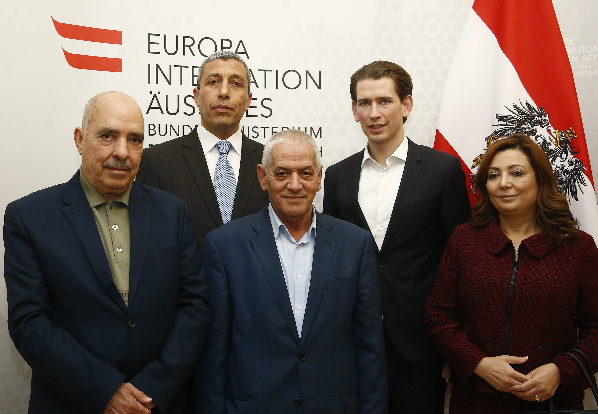
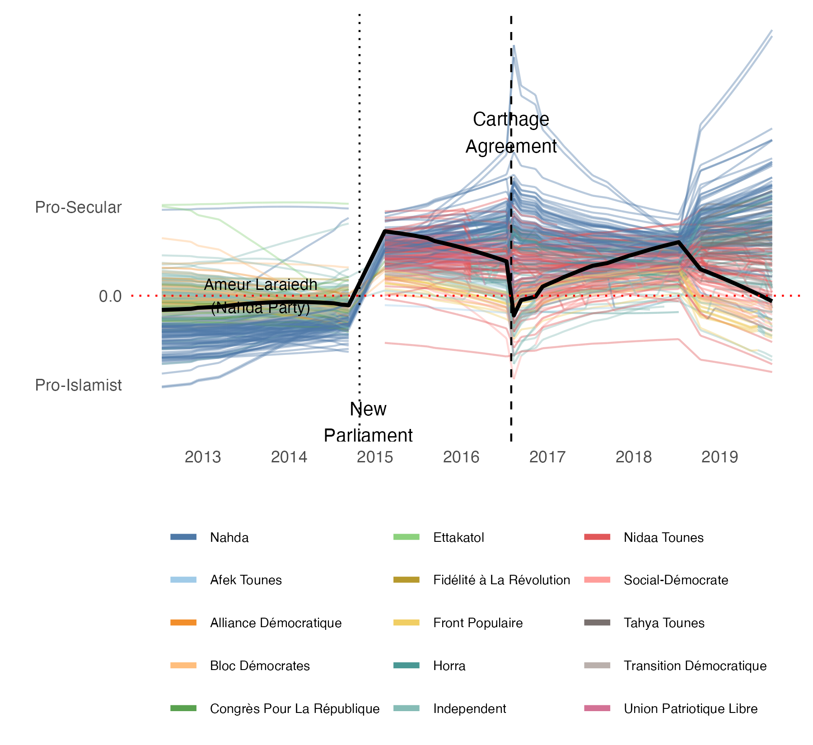
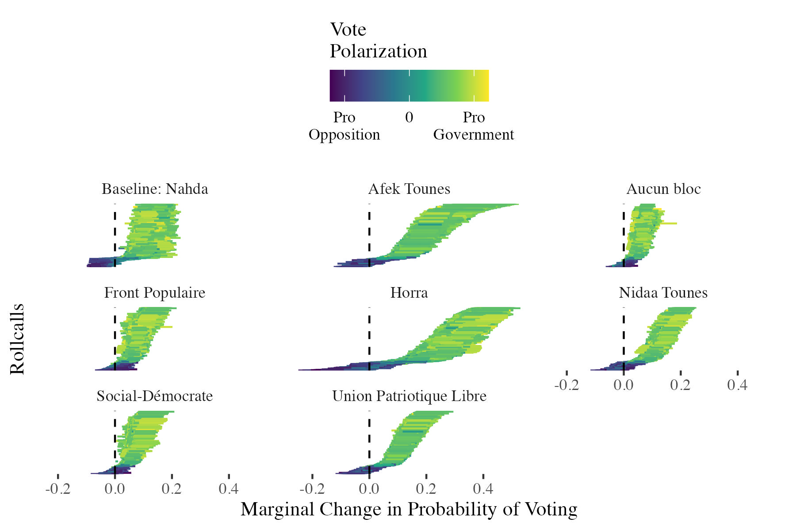
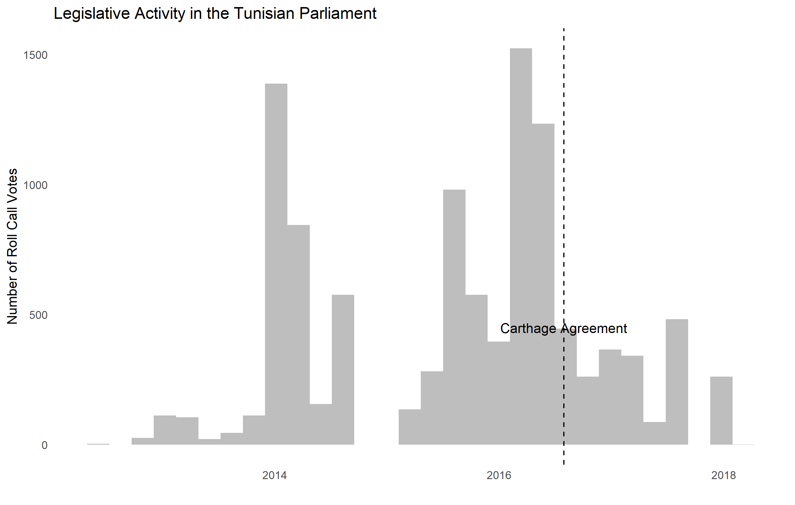
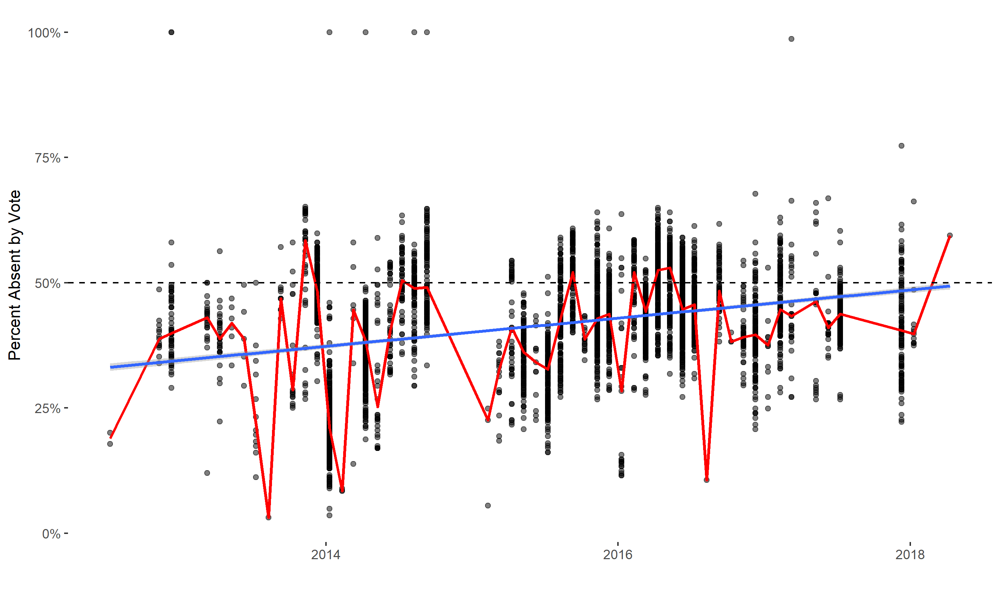

```{r setup, include=FALSE}

library(tidyverse)
library(ggplot2)
library(tidyverse)

# number of sims 

S <- 1000

# number of obs

N <- 100

set.seed(55373)

```

## 2015 Noble Peace Prize



## OOOPS


## Power-Sharing

1.  Power-sharing is an oft-recommended policy when countries have problems.
2.  Present in many established democracies: the filibuster, for example.
3.  Distinct from minority rights as power-sharing demands co-governance.
4.  Can be either formal or informal.

## Tunisia Power-Sharing

1.  Islamist Nahda wins majority in first constitution assembly (secular parties disorganized).
2.  Secular-Islamist polarization in first legislature.
3.  Terrorist attacks in 2015 (Bardo, Sousse).
4.  Quartet negotiates national unity government, wins Nobel Prize.

## Tunisia Power-Sharing

1.  New parliament elected in 2015.
2.  Secularist Nidaa Tounes wins plurality, then forms alliance with Nahda.
3.  \~80% of parliament in the same coalition.
4.  Carthage Agreement in 2016 re-affirms commitment to "national unity."
5.  However, democracy collapses in 2021.

## Power-Sharing Failure?

{fig-align="center"}

## Our Argument

1.  Power-sharing is meant to avert violence but also strengthens elites vs. elected representatives.
2.  "State of exception"
3.  Citizens lose interest in democratic institutions as legislation is never produced.
4.  Leaves room for populism/anti-establishment movements.

## What Do Power-Sharing Agreements Really Do?

1.  We collected all rollcall votes for both parliaments from the Tunisian NGO Bawsala.
2.  We fit a time-varying ideal point model (`idealstan`) to see how MP ideal points change by month from 2014 to 2019.
3.  We can see to what extent legislative behavior changes before/after power-sharing agreements.
4.  Also, are there substantive differences in legislation?

## High Turnover in Elections


## Over-Time Trajectories for 2014 - 2019



## Over-Time Trajectories for 2016 - 2019

{fig-align="center"}

## Vote-Level Marginal Effects



## Legislative Activity Changes



## Rising Abstentions



## References